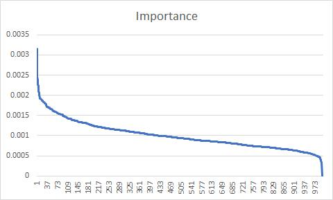

# 2022 FINTECH80 UESTC比赛
*成都西财举办的金融科技比赛FINTECH80数据集*

## 文件目录结构：
- `./train/`：共包含73500条数据
- `./test/`：共包含24500条数据

## 备注
- 不均衡数据集，二分类问题，拒绝贷款的分类比例在2%左右
	- 训练集label=1 (1543/73500=**2%**)
	- 测试集label=1 (514/24500=**2%**)

- 特征维度共1000维，由185个整数类型和816个浮点数类型组成
	- 起始值为0的特征 (527/1000=**52%**)
	- 起始值为1的特征 (2/1000=**0.2%**)
	- 最小值-106.27352
	- 最大值23842

- 特征重要性排序
	- 
